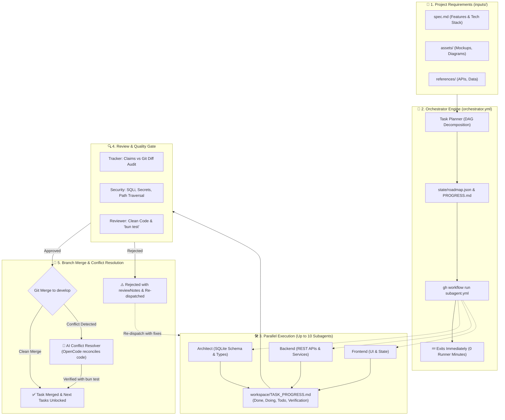
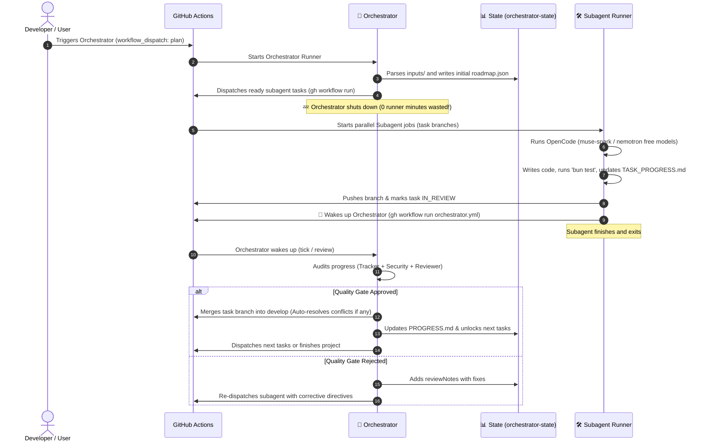
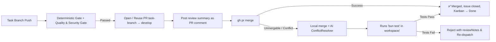

# 🚀 OpenCode Multi-Agent GitHub Actions Orchestrator

An enterprise-grade, autonomous multi-agent software engineering framework that plans, develops, audits, tests, and merges complete applications inside **GitHub Actions** using **OpenCode**.

---

## 🌟 1. System Architecture & Workflows

### A. End-to-End Orchestration Flowchart



---

### B. Event-Driven Wakeup & Zero-Cost Lifecycle



---

### C. PR Review & Automated Merge Conflict Resolution



---

## 🎯 2. Core Pillars & Design Principles

### 1. 📝 Double-Layered Progress Tracking (Done, Doing, Todo & Verification)
- **Global Roadmap ([`state/PROGRESS.md`](state/PROGRESS.md) & [`state/roadmap.json`](state/roadmap.json)):**  
  Maintained by the Orchestrator. Displays the master project status, completed milestones, queued tasks, and active subagent runs.
- **Task Progress Report ([`workspace/TASK_PROGRESS.md`](workspace/TASK_PROGRESS.md)):**  
  Maintained by each subagent on its task branch. Strictly formatted:
  - **1. ✅ Done:** Concrete list of created/modified files and functions.
  - **2. ⚡ Doing:** Current operational status.
  - **3. 📋 Todo:** Next steps or integration notes for downstream tasks.
  - **4. 🧪 Verification & Test Proof:** Terminal output of `bun test` proving zero errors.
- **Tracker Agent Audit:** The `tracker` subagent cross-references claimed progress against the actual `git diff` to eliminate hallucinations and incomplete implementations.

### 2. 🛡️ Enterprise Security & Quality Gate
Before any branch is merged into `develop`:
- **Security Auditor ([`subagents/prompts/roles/security.md`](subagents/prompts/roles/security.md)):**  
  Scans code for SQLite SQL Injection (enforcing prepared statements), secret/token leaks, path traversal, command injection, and resource exhaustion. Generates `workspace/SECURITY_AUDIT.md`.
- **SQLite Hardening (skill `sqlite-hardening`):**
  Enforces WAL mode (`PRAGMA journal_mode = WAL;`), 5000ms busy timeouts, and foreign keys for high CI concurrency.
- **API Contracts (skill `api-contracts`), UI Conventions (skill `ui-conventions`), Test Evidence (skill `test-evidence`):**
  Role-specific native skills under [`.opencode/skills/`](.opencode/skills/) — deterministically injected per role and reloadable on demand via the `skill` tool.
- **Universal craft skills:** `systematic-debugging`, `test-driven-development`, `api-design`, `sql-review`, `web-accessibility`, `auth-review`, `i18n`, `design-system`, `error-handling`, `backend-structure`, `mobile-essentials`, `deployment-readiness`, `observability-basics`, `performance-budgets`, `external-integrations`, `documentation-discipline`, `frontend-stack` — injected for the most relevant roles, natively discoverable by every agent.
- **No framework lock-in:** shadcn/Next.js/Nuxt/Blazor skills are deliberately NOT vendored (stale fast, bloat). Instead: docs-first protocol (`frontend-stack`), live official docs via `webfetch`, and project skill drops at `inputs/skills/<role>-<name>/SKILL.md` (auto-injected for that role, travel with project data).
- **Code Reviewer ([`subagents/prompts/roles/reviewer.md`](subagents/prompts/roles/reviewer.md)):**  
  Enforces clean code standards, SOLID principles, error boundaries, and regression safety.

### 3. ⚡ Concurrency & Conflict Prevention
- **Isolated Git Branches:** Every subagent works on a separate branch (`task/<taskId>`).
- **Disjoint Scoping:** Orchestrator assigns non-overlapping target files (e.g. `src/db/*` vs `src/ui/*`) to independent parallel tasks.
- **AI Conflict Resolver ([`orchestrator/conflict_resolver.ts`](orchestrator/conflict_resolver.ts)):**  
  If two branches modify the same file (e.g. adding dependencies to `package.json` or routes to `index.ts`), OpenCode analyzes Git conflict markers, cleanly merges both changes, validates with `bun test`, and commits the resolved merge autonomously!

### 4. 🎁 100% Free-Tier & Zero-Cost Model Cascade
OpenCode allows execution without registration or API keys through generous IP-rate-limited free models. Because **every GitHub Actions runner receives a brand-new IP address**, rate limits are practically non-existent across runs!
The built-in [`OpenCodeClient`](orchestrator/opencode_client.ts) features an automatic fallback cascade:
1. `opencode/muse-spark-1.3-contributor-free` *(Primary & High Quality)*
2. `opencode/nemotron-3-ultra-free` *(Fallback 1)*
3. `opencode/mimo-v2.6-flash-free` *(Fallback 2)*
4. `opencode/big-pickle` *(Fallback 3)*
5. `opencode/space-bunny-free` *(Fallback 4)*

### 5. ⏱️ Actions Timeouts & Deadlock Watchdog
- **Subagents:** `timeout-minutes: 35` (Broad window for compilation, tests, and free model latency, while preventing quota exhaustion).
- **Orchestrator:** `timeout-minutes: 10` (Quick review & dispatch cycle).
- **Watchdog Observation:** The Orchestrator monitors active runs via `gh run list --workflow subagent.yml --status in_progress` and can intervene via `gh run cancel` to re-steer stalled tasks.

### 6. 📊 Native GitHub Projects (v2) Kanban Board & Milestones
The Orchestrator natively interfaces with **GitHub Projects (v2)** via the `gh project` CLI:
- **Interactive Kanban Board:** Automatically creates and links a project board (`<ProjectName> Kanban Board`) with columns:
  - 📋 `Todo`: Queued tasks waiting for dependencies.
  - ⚡ `In Progress`: Actively executing subagent tasks.
  - 🔍 `In Review`: Finished tasks under Quality Gate inspection.
  - ✅ `Done`: Verified and merged tasks.
- **Product Owner Interactivity:** You can drag and drop cards to adjust priorities or add new issues; the Orchestrator reads project updates on every tick!
- **Categorized Milestones:** Groups tasks under structured milestones (e.g. `v0.1.0 - Foundation & Schema`, `v0.2.0 - Core Services & API`, `v1.0.0 - Release`).
- **Live Issue Updates:** Each task is tracked as a native GitHub Issue with real-time status comments.

### 7. 📜 Shared System Contracts Bridge (`workspace/CONTRACTS.md`)
To ensure frontend and QA subagents build against exact API definitions:
- Architect and Backend agents automatically document schemas, endpoint URLs, request shapes, and response codes in `workspace/CONTRACTS.md`.
- `subagents/runner.ts` automatically injects this contract file into dependent subagents so they never guess endpoint paths or parameter names.

### 8. 🏷️ Milestone Releases & Git Tags
Upon completing project milestones or reaching 100% completion, the Orchestrator automatically:
- Creates a semantic Git Tag (e.g. `v1.0.0`).
- Publishes a formal GitHub Release with changelogs and deliverables summary via `gh release create`.

### 9. ⚡ GitHub Actions Caching
Both `orchestrator.yml` and `subagent.yml` utilize `actions/cache@v4` to cache Bun packages and the OpenCode binary across runs, slashing job spin-up times from 40s down to 5s.

### 10. 💬 Interactive ChatOps Control Center
You can steer, pause, or query the autonomous team directly from GitHub Issue comments on the Dashboard Issue:
- `/pause`: Pause new task dispatches while letting active runs safely finish.
- `/resume`: Unpause scheduling and dispatch the next batch of ready tasks.
- `/directive <TASK-ID> "instruction"`: Inject new directives or course corrections into a task; automatically cancels any active run and re-queues it with the directive.
- `/retry <TASK-ID>`: Reset retry counter to 0 and re-queue a failed or stuck task.
- `/status`: Post an instantaneous progress snapshot comment.
- `/discuss <TASK-ID> "message"`: Relay a message to the task's agent discussion thread (agents read it on retry).

---

## 👥 3. Agent Ecosystem & Responsibilities

| Role | System Prompt | Primary Mission | Key Deliverables |
| :--- | :--- | :--- | :--- |
| **Orchestrator** | [`orchestrator/prompts/system.md`](orchestrator/prompts/system.md) | Plans roadmap, decomposes tasks, monitors execution, resolves conflicts, merges branches. | `state/roadmap.json`, `state/PROGRESS.md`, PR Merges |
| **System Architect** | [`subagents/prompts/roles/architect.md`](subagents/prompts/roles/architect.md) | Initializes foundation, sets up SQLite schemas, shared TypeScript contracts. | `src/db/schema.ts`, `src/types/`, migrations |
| **Backend Developer** | [`subagents/prompts/roles/backend.md`](subagents/prompts/roles/backend.md) | Implements REST APIs, controllers, services, and database queries. | `src/api/**`, `src/services/**`, unit tests |
| **Frontend Developer**| [`subagents/prompts/roles/frontend.md`](subagents/prompts/roles/frontend.md) | Builds responsive UI, components, styling, and client-side state. | `src/ui/**`, client bundler configs |
| **Mobile Developer**| [`subagents/prompts/roles/mobile.md`](subagents/prompts/roles/mobile.md) | Builds mobile features: offline-first, permissions, push, store readiness. | `src/mobile/**`, platform configs |
| **QA Engineer** | [`subagents/prompts/roles/qa.md`](subagents/prompts/roles/qa.md) | Writes automated unit and integration tests using `bun test`. | `tests/**`, test execution logs |
| **Security Auditor** | [`subagents/prompts/roles/security.md`](subagents/prompts/roles/security.md) | Audits SQL injection, secret leaks, path traversal, payload size limits. | `workspace/SECURITY_AUDIT.md` |
| **Progress Tracker** | [`subagents/prompts/roles/tracker.md`](subagents/prompts/roles/tracker.md) | Audits `TASK_PROGRESS.md` claims against actual git diffs to eliminate hallucinations. | Progress audit reports |
| **Code Reviewer** | [`subagents/prompts/roles/reviewer.md`](subagents/prompts/roles/reviewer.md) | Evaluates clean code standards, error boundaries, edge cases, regression risks. | Review evaluation JSON & comments |

---

## 📂 4. Project Directory Structure

```
Orchestrator/
├── .github/
│   └── workflows/
│       ├── orchestrator.yml        # Orchestrator runner (cron + manual + subagent event triggers)
│       └── subagent.yml            # Subagent task worker (runs OpenCode in headless CI)
├── AGENTS.md                       # Master operational constitution for all agents
├── inputs/                         # Put your project specs here
│   ├── README.md                   # Guide for inputs
│   ├── spec.md                     # Target project requirements
│   ├── assets/                     # Mockups, screenshots, architecture diagrams
│   └── references/                 # API specs, sample data, URLs
├── orchestrator/
│   ├── config.ts                   # Concurrency limits, timeouts & fallback models
│   ├── types.ts                    # TypeScript schemas for tasks, roadmap, reports
│   ├── opencode_client.ts          # Free-tier model fallback runner
│   ├── project_manager.ts          # GitHub Projects v2, Milestones & Issues bridge
│   ├── conflict_resolver.ts        # AI-driven Git merge conflict resolver
│   ├── issue_manager.ts            # Master Issue & Release Manager
│   ├── state_manager.ts            # Roadmap state & PROGRESS.md generator
│   ├── git_manager.ts              # Git branching, merging, and gh CLI bridge
│   ├── engine.ts                   # Main orchestration engine (plan, review, tick)
│   └── prompts/
│       ├── system.md               # Orchestrator rules & environment constraints
│       ├── planner.md              # Task decomposition & DAG generation prompt
│       ├── reviewer.md             # Subagent evaluation and approval prompt
│       └── conflict_resolver.md    # Conflict resolution prompt
├── subagents/
│   ├── runner.ts                   # Subagent executor running OpenCode
│   ├── skills/                     # Injected operational skill guides
│   │   ├── security_scan.md        # Vulnerability detection checklist
│   │   ├── sqlite_hardening.md     # WAL mode & query hardening
│   │   └── code_review.md          # Code review rubric
│   └── prompts/
│       ├── base_agent.md           # Instructions for TASK_PROGRESS.md & SQLite
│       └── roles/                  # Role-specific system prompts
│           ├── architect.md        # Database schema & project scaffolding
│           ├── backend.md          # REST APIs & business logic
│           ├── frontend.md         # UI components & styling
│           ├── qa.md               # Unit, integration & E2E tests
│           ├── security.md         # Vulnerability & security auditor
│           └── tracker.md          # Deliverables auditor & diff verifier
├── state/
│   ├── roadmap.json                # Master JSON DAG state
│   └── PROGRESS.md                 # Auto-generated markdown progress board
└── workspace/                      # Target application code generated by subagents
```

---

## 🛠️ 5. Getting Started

### Step 1: Configure GitHub Personal Access Token (PAT)
To enable the Orchestrator to manage GitHub Projects v2 and Milestones:
1. Generate a **Personal Access Token (PAT)** on GitHub (**Settings > Developer settings > Personal access tokens**):
   - Scopes required: `repo` (Full control), `project` (Full control of projects), `discussion` (Write).
2. Go to your repository **Settings > Secrets and variables > Actions**.
3. Create a repository secret named **`GH_PROJECT_TOKEN`** with your token value.
4. Under **Settings > Actions > General > Workflow permissions**, select **"Read and write permissions"** and check **"Allow GitHub Actions to create and approve pull requests"**.
5. *(Optional)* Add API keys (`ANTHROPIC_API_KEY`, etc.) if you wish to use paid models instead of the built-in free models.

### Step 2: Define Your Target Project
Edit [`inputs/spec.md`](inputs/spec.md) with your project requirements, user stories, and tech stack preferences. Add any visual mockups into `inputs/assets/`.

### Step 2b (optional): Dual-repo mode — public skeleton + private data
To run this template as a **public** repo while keeping project content private:
1. Create a **private** repository for project data (e.g. `my-org/my-project-data`).
2. Push your real `inputs/` + `workspace/` content there (any branch layout; the orchestrator seeds `develop` on first `plan` if missing).
3. Add two repository secrets to the **public** repo:
   - **`DATA_REPO`** = `owner/name` (or full URL) of the private data repo.
   - **`DATA_PAT`** = classic PAT with `repo` scope (read/write on the data repo). Defaults to `GH_PROJECT_TOKEN` when empty.
5. *(Optional)* Feature toggles as repository **Variables** (Settings → Secrets and variables → Actions → Variables):
   - `PUBLIC_FEATURES` (default `issues,discussions,projects`), `DATA_FEATURES` (default `discussions`) — comma lists from `issues|wiki|projects|discussions`. Enforced by `action=setup` or dashboard `/setup [public|data|all]`. (Pull requests have no off switch on GitHub.)
4. `inputs/*` (except templates), `workspace/*` and `state/*` are `.gitignore`d here: CI materializes them from the data repo at runtime and publishes agent output back to data branches. Task branches and review **PRs live in the data repo**; issues/milestones/board stay public (titles + statuses only, bodies redacted), and the dashboard renders **redacted** (IDs/roles/statuses, no titles or notes).

Leave `DATA_REPO` empty for classic single-repo mode (everything in one repo).

### Step 3: Trigger the Orchestrator
1. Open the **Actions** tab on GitHub.
2. Select **🤖 Orchestrator Engine**.
3. Click **Run workflow** (Action: `plan`).

The Orchestrator will decompose the project, launch the first batch of subagents, and shut down. From that point forward, the subagents will build the application, trigger the review gates, resolve any conflicts, and assemble the working software into `workspace/`!

---

## 💻 Local Development & CLI

You can run and test the entire engine locally using **Bun**:

```bash
# Install dependencies
bun install

# Run planning phase locally from inputs/
bun run orchestrator:plan

# Run tick cycle (review & dispatch ready tasks)
bun run orchestrator:tick

# Run a specific subagent manually
bun run subagents/runner.ts --taskId=TASK-001 --role=architect --branch=task/TASK-001
```
